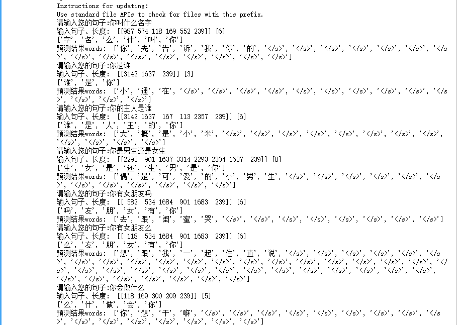
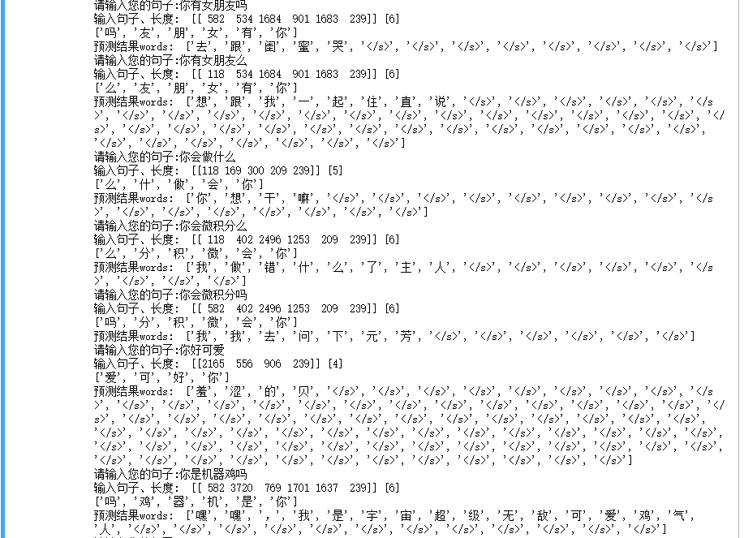

# ChatBot-based-on-xiaohuangji
A chatbot using modified seq2seq model, based on xiaohuangji corpus.

    该模型基于Seq2Seq model，在小黄鸡语料库上训练了200轮左右，经过多次调参，得到相对较好的模型。

## 模型主要的细节如下：
    >  1. 语料按字分词，通过正则表达式清洗数据，然后导出问答对。该问答对筛选方法可应用于多轮对话问答对提取，已在电影对话数据集上实验。
   [更多中文对话数据集](https://github.com/candlewill/Dialog_Corpus)
    >  2. 训练数据按长度划分bucket，提高训练速度和推理速度。[code](data_utils.py)
    >  3. 使用多线程生成mini batch的数据，提高数据加载的效率。[code](threadedgenerator.py)
    >  4. 模型使用4层LSTM单元作为编码解码单元[code](seq_2_seq.py)，主要特点：
              - 模型在常规decoder的基础上，增加了一个anti decoder主要计算dummy inputs输入的损失，并将其作为负的loss反向传播，提升模型的泛化能力。
              - 模型实现了以上一步的输出结果作为reward进行下一步输入的weighted mask，但实际提升不明显。
              - 模型将输入序列反转，以提升解码初始阶段的准确性，从而提升后续步骤的准确性。
              - encoder使用bidirectional LSTM，同时使用residual结构优化模型，实验发现在本数据集上提升很小。
              - 使用在bidirectional encoder中表现较好的bahdanau attention mechanism，也可以使用normed_bahdanau。
              - 使用gradient clipping防止梯度爆炸。
              - decoder在预测时使用beam search方法，但其计算的最优结果返回的短文本效果较差，因此在选择最优search时做了相应修改。
              - 模型共享encoder和decoder的embedding，得到的结果有所提升。
              - 使用Flask将模型进行发布。
 
 ---
 
 ## 模型可优化点：
     > 1. 训练阶段可使用Scheduled sampling，来解决decoder在接收到“未见过的decoder input”时，解码出较差结果的问题。
     > 2. 使用多GPU训练不同的Layer，加速训练。注意使用GNMTAttentionMultiCell, 解码器的每一步就可以在前一步的第一层和 attention 计算完成之后就可以进行解码。
'''python
cells = []
for i in range(num_layers):
  cells.append(tf.contrib.rnn.DeviceWrapper(
      tf.contrib.rnn.LSTMCell(num_units),
      "/gpu:%d" % (num_layers % num_gpus)))
attention_cell = cells.pop(0)
attention_cell = tf.contrib.seq2seq.AttentionWrapper(
    attention_cell,
    attention_mechanism,
    attention_layer_size=None,  # don't add an additional dense layer.
    output_attention=False,)
cell = GNMTAttentionMultiCell(attention_cell, cells)
'''
     > 3. 模型在推理阶段的速度可以进一步优化。

---

## 模型效果
[运行的jupyter notebook文件](chatbot.ipynb)

              
